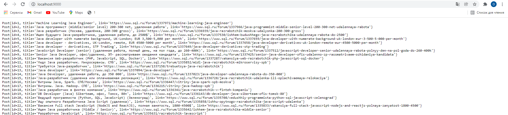

# job4j_grabber

## Description
This project is the HTML grabber.

### Used technologies:
1. JDBC
2. Jsoup for parsing
3. Quartz scheduler
4. Sl4j fo logging

### Functionality:

1. Grabbing Java vacancies from sql.ru
2. CRUD operations for vacancies
3. Loading result in HTML page using HTTP server

### Contact
If you have any questions, feel free to contact me: oleg.kolchin.j@gmail.com

